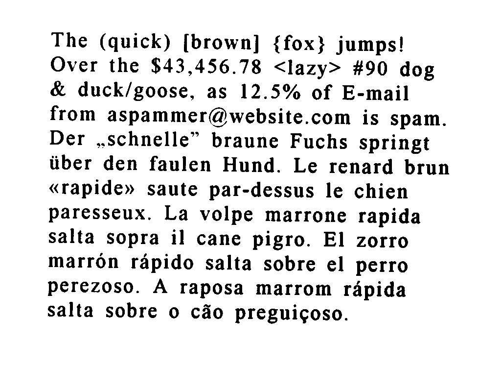

### Tesseract 

The following is purpose of this document:
- what is tessearact?
- What languages does tessract support?
- How to use tesseract?
- How to improve the quality of tesseract output?

Following links have been used for documentation. 

[Document Reference1](https://github.com/tesseract-ocr/tesseract/blob/master/doc/tesseract.1.asc#config-files-and-augmenting-with-user-data)

[Document Reference2](https://tesseract-ocr.github.io/tessdoc/ImproveQuality.html#page-segmentation-method)

[Document Reference3](https://tesseract-ocr.github.io/tessdoc/ImproveQuality.html)

[Document Reference4](https://github.com/tesseract-ocr/tesseract)


**About**

Tesseract is an optical character recognition engine for various operating systems. It is free software, 
released under the Apache License, Version 2.0, and development has been sponsored by Google since 2006. 
In 2006, Tesseract was considered one of the most accurate open-source OCR engines then available

**Language support:**

Tesseract has unicode (UTF-8) support, and can recognize more than 100 languages "out of the box".

**Output formats:**

Tesseract supports various output formats: plain text, hOCR (HTML), PDF, invisible-text-only PDF,\
 TSV. The master branch also has experimental support for ALTO (XML) output.

**Improving quality of output of tesseract:**

You should note that in many cases, in order to get better OCR results, you'll need to improve the 
quality of the image you are giving Tesseract.

Click the following link:
[improve quality of output](https://tesseract-ocr.github.io/tessdoc/ImproveQuality.html)

### Running Tesseract : Command line parameters definitions 

`tesseract INPUT_FILE OUTPUT_FILE [OPTIONS]…​ [CONFIGFILE]…​`

**IN/OUT ARGUMENTS**

**INPUT_FILE**

The name of the input file. This can either be an image file or a text file.
Most image file formats (anything readable by Leptonica) are supported.
A text file lists the names of all input images (one image name per line). The results will be combined in a 
single file for each output file format (txt, pdf, hocr, xml).
If FILE is stdin or - then the standard input is used.

**OUTPUT_FILE**

The basename of the output file (to which the appropriate extension will be appended). By default the output 
will be a text file with .txt added to the basename unless there are one or more parameters set 
which explicitly specify the desired output.
If OUTPUTBASE is stdout or - then the standard output is used.

**OPTIONS**

`-c CONFIGVAR=VALUE`

Set value for parameter CONFIGVAR to VALUE. Multiple -c arguments are allowed.

`--dpi N`

Specify the resolution N in DPI for the input image(s). A typical value for N is 300.
Without this option, the resolution is read from the metadata included in the image. If an image 
does not include that information, Tesseract tries to guess it.

`-l LANG`

`-l SCRIPT`

The language or script to use. If none is specified, eng (English) is assumed. Multiple languages 
may be specified, separated by plus characters. Tesseract uses 3-character ISO 639-2 language codes
 (see LANGUAGES AND SCRIPTS).

`--psm N`

Set Tesseract to only run a subset of layout analysis and assume a certain form of image. 
The options for N are:

```
0 = Orientation and script detection (OSD) only.
1 = Automatic page segmentation with OSD.
2 = Automatic page segmentation, but no OSD, or OCR. (not implemented)
3 = Fully automatic page segmentation, but no OSD. (Default)
4 = Assume a single column of text of variable sizes.
5 = Assume a single uniform block of vertically aligned text.
6 = Assume a single uniform block of text.
7 = Treat the image as a single text line.
8 = Treat the image as a single word.
9 = Treat the image as a single word in a circle.
10 = Treat the image as a single character.
11 = Sparse text. Find as much text as possible in no particular order.
12 = Sparse text with OSD.
13 = Raw line. Treat the image as a single text line,
     bypassing hacks that are Tesseract-specific.
```

`--oem N`

Specify OCR Engine mode. The options for N are:

```
0 = Original Tesseract only.
1 = Neural nets LSTM only.
2 = Tesseract + LSTM.
3 = Default, based on what is available.
```

`--tessdata-dir` PATH

Specify the location of tessdata path.

`--user-patterns` FILE

Specify the location of user patterns file.

`--user-words` FILE

Specify the location of user words file.

`CONFIGFILE`

The name of a config to use. The name can be a file in tessdata/configs or tessdata/tessconfigs, 
or an absolute or relative file path. A config is a plain text file which contains a list of parameters 
and their values, one per line, with a space separating parameter from value.

Interesting config files include:

```
alto — Output in ALTO format (OUTPUTBASE.xml).

hocr — Output in hOCR format (OUTPUTBASE.hocr).

pdf — Output PDF (OUTPUTBASE.pdf).

tsv — Output TSV (OUTPUTBASE.tsv).

txt — Output plain text (OUTPUTBASE.txt).

get.images — Write processed input images to file (tessinput.tif).

logfile — Redirect debug messages to file (tesseract.log).

lstm.train — Output files used by LSTM training (OUTPUTBASE.lstmf).

makebox — Write box file (OUTPUTBASE.box).

quiet — Redirect debug messages to /dev/null.

```

It is possible to select several config files, for example tesseract image.png demo alto hocr pdf txt 
will create four output files demo.alto, demo.hocr, demo.pdf and demo.txt with the OCR results.

Note: The options -l LANG, -l SCRIPT and --psm N must occur before any CONFIGFILE.

**SINGLE OPTIONS**

`-h`, `--help`
Show help message.

`--help-extra`
Show extra help for advanced users.

`--help-psm`
Show page segmentation modes.

`--help-oem`
Show OCR Engine modes.

`-v`, `--version`
Returns the current version of the tesseract(1) executable.

`--list-langs`
List available languages for tesseract engine. Can be used with --tessdata-dir PATH.

`--print-parameters`
Print tesseract parameters.

### Basic command line usage with examples

`tesseract imagename outputbase [-l lang] [--oem ocrenginemode] [--psm pagesegmode] [configfiles...]`

For more information about the various command line options use `tesseract --help` or `man tesseract`.

### Examples:

**Simplest Invocation to OCR an image**

`tesseract imagename outputbase`

This uses English as the default language and 3 as the Page Segmentation Mode. The default output format is text.

`TESSDATA_PREFIX` environment variable should be set to the parent directory of “tessdata” directory.

osd.traineddata, for Orientation and Segmentation and eng.traineddata and other language data files 
for English should be in the “`tessdata`” directory. 

The following command would give the same result as above, if eng.traineddata and osd.traineddata files 
are in /usr/share/tessdata directory.

`tesseract --tessdata-dir /usr/share imagename outputbase -l eng --psm 3`

Following examples use this image which has text in multiple languages.



**Using One Language**
Add ‘`-l LANG`’ to the command where LANG is three character language code from the list of 
supported languages. If this is not given then English language is assumed by default.

`tesseract testing/eurotext.png testing/eurotext-eng -l eng`

Output

```
The (quick) [brown] {fox} jumps!
Over the $43,456.78 <lazy> #90 dog
& duck/goose, as 12.5% of E-mail
from aspammer@website.com is spam.
Der ,,schnelle” braune Fuchs springt
fiber den faulen Hund. Le renard brun
«rapide» saute par-dessus le chien
paresseux. La volpe marrone rapida
salta sopra i] cane pigro. El zorro
marrén répido salta sobre el perro
perezoso. A raposa marrom répida
salta sobre 0 C50 preguieoso.
```

**Using Multiple Languages**

Add ‘`-l LANG[+LANG]`’ to the command line to use multiple languages together for recognition

`tesseract testing/eurotext.png testing/eurotext-engdeu -l eng+deu`

Output

The (quick) [brown] {fox} jumps!
Over the $43,456.78 <lazy> #90 dog
& duck/goose, as 12.5% of E-mail
from aspammer@website.com is spam.
Der „schnelle” braune Fuchs springt
über den faulen Hund. Le renard brun
«rapide» saute par-dessus le chien
paresseux. La volpe marrone rapida
salta sopra il cane pigro. El zorro
marrön räpido salta sobre el perro
perezoso. A raposa marrom räpida
salta sobre o cäo preguieoso.

**Order of multiple languages**

The output can be different based on the order of languages,
so -l eng+hin can give different result than -l hin+eng.

**Searchable pdf output**

`tesseract testing/eurotext.png testing/eurotext-eng -l eng pdf`

This creates a pdf with the image and a separate searchable text layer with the recognized 
text.

`tesseract c:\temp\test_ara.jpg -l ara -psm 3 c:\temp\test_ara pdf`

**Text output with its coordinates:**

`HOCR output`

Use ‘`hocr`’ config file by adding `hocr` at the end of the command to get the HOCR output.

Example:

`tesseract testing/eurotext.png testing/eurotext-eng -l eng hocr`

Partial Output

```
<?xml version="1.0" encoding="UTF-8"?>
<!DOCTYPE html PUBLIC "-//W3C//DTD XHTML 1.0 Transitional//EN"
    "http://www.w3.org/TR/xhtml1/DTD/xhtml1-transitional.dtd">
<html xmlns="http://www.w3.org/1999/xhtml" xml:lang="en" lang="en">
 <head>
  <title></title>
<meta http-equiv="Content-Type" content="text/html;charset=utf-8" />
  <meta name='ocr-system' content='tesseract 3.05.00dev' />
  <meta name='ocr-capabilities' content='ocr_page ocr_carea ocr_par ocr_line ocrx_word'/>
</head>
<body>
  <div class='ocr_page' id='page_1' title='image "./testing/eurotext.png"; bbox 0 0 1024 800; ppageno 0'>
   <div class='ocr_carea' id='block_1_1' title="bbox 98 66 918 661">
    <p class='ocr_par' id='par_1_1' lang='eng' title="bbox 98 66 918 661">
     <span class='ocr_line' id='line_1_1' title="bbox 105 66 823 113; baseline 0.015 -18; x_size 39; x_descenders 7; x_ascenders 9"><span class='ocrx_word' id='word_1_1' title='bbox 105 66 178 97; x_wconf 90'>The</span> <span class='ocrx_word' id='word_1_2' title='bbox 205 67 347 106; x_wconf 87'><strong>(quick)</strong></span> <span class='ocrx_word' id='word_1_3' title='bbox 376 69 528 109; x_wconf 89'>[brown]</span> <span class='ocrx_word' id='word_1_4' title='bbox 559 71 663 110; x_wconf 89'>{fox}</span> <span class='ocrx_word' id='word_1_5' title='bbox 687 73 823 113; x_wconf 89'>jumps!</span> 
     </span>
    </p>
   </div>
  </div>
 </body>
</html>
```

**TSV output** 

Use ‘`tsv`’ config file by adding tsv at the end of the command to get the TSV output.

Example:

`tesseract testing/eurotext.png testing/eurotext-eng -l eng tsv`

Partial Output

```
level	page_num	block_num	par_num	line_num	word_num	left	top	width	height	conf	text
1	1	0	0	0	0	0	0	1024	800	-1	
2	1	1	0	0	0	98	66	821	596	-1	
3	1	1	1	0	0	98	66	821	596	-1	
4	1	1	1	1	0	105	66	719	48	-1	
5	1	1	1	1	1	105	66	74	32	90	The
5	1	1	1	1	2	205	67	143	40	87	(quick)
5	1	1	1	1	3	376	69	153	41	89	[brown]
5	1	1	1	1	4	559	71	105	40	89	{fox}
5	1	1	1	1	5	687	73	137	41	89	jumps!
```

**Using different Page Segmentation Modes**

>By default Tesseract is optimized to recognize sentences of words. If you’re trying to recognize
> something else, like receipts, price lists, or codes, there are a few things you can do to improve 
>the accuracy of your results, by appropriate segmentation method is selected.

**Page segmentation method**

By default Tesseract expects a page of text when it segments an image. If you’re just seeking to OCR
a small region, try a different segmentation mode, using the --psm argument

To see a complete list of supported page segmentation modes, use `tesseract -h`


**Dictionaries in tesseract**

Disabling the dictionaries Tesseract uses should increase recognition if most of your text isn’t dictionary words. They 
can be disabled by setting both of the configuration variables `load_system_dawg` and `load_freq_dawg` to `false`.

[control parameters and config files](https://tesseract-ocr.github.io/tessdoc/ControlParams)

**Tuning Tesseract:**

[Tuning Tessearct](https://github.com/tesseract-ocr/tesseract/blob/master/doc/tesseract.1.asc#config-files-and-augmenting-with-user-data)

